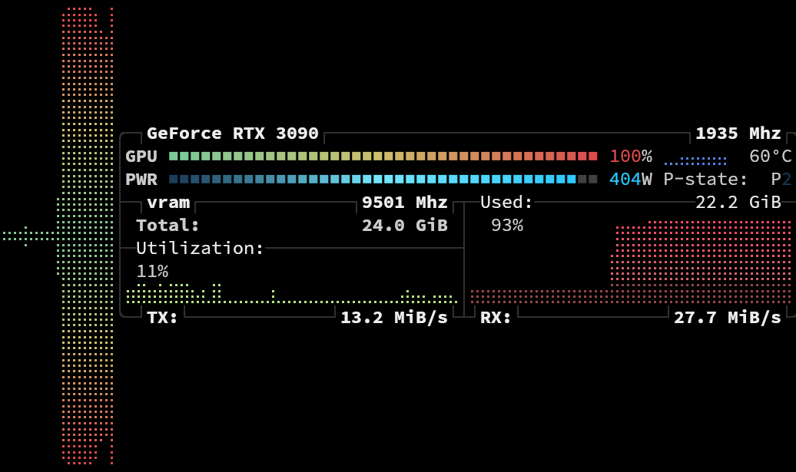
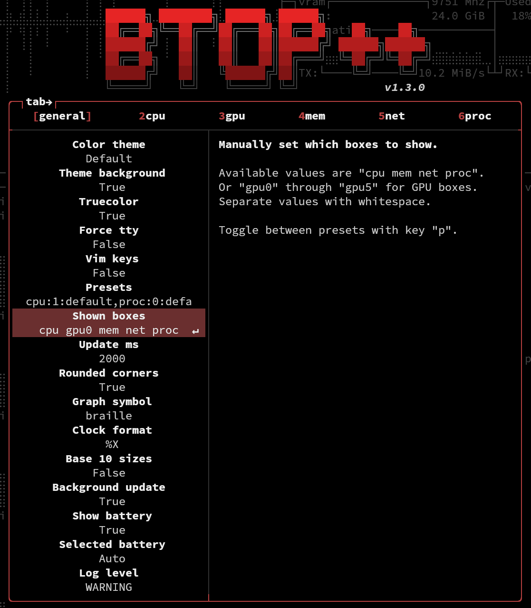
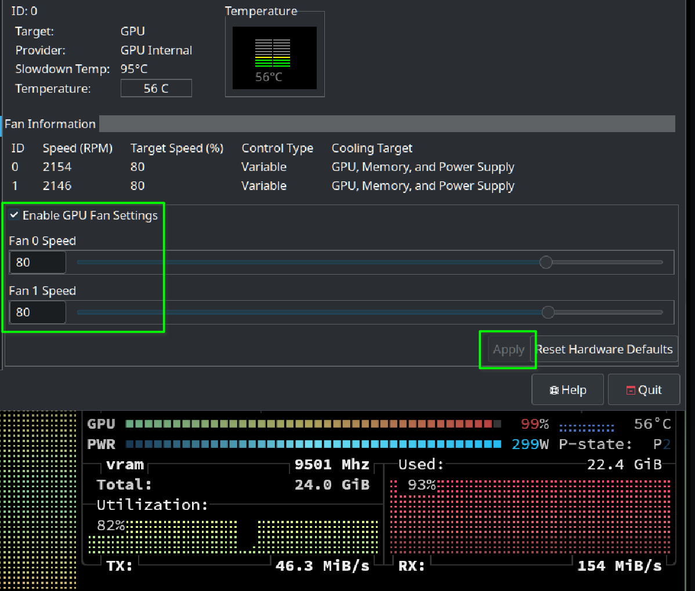
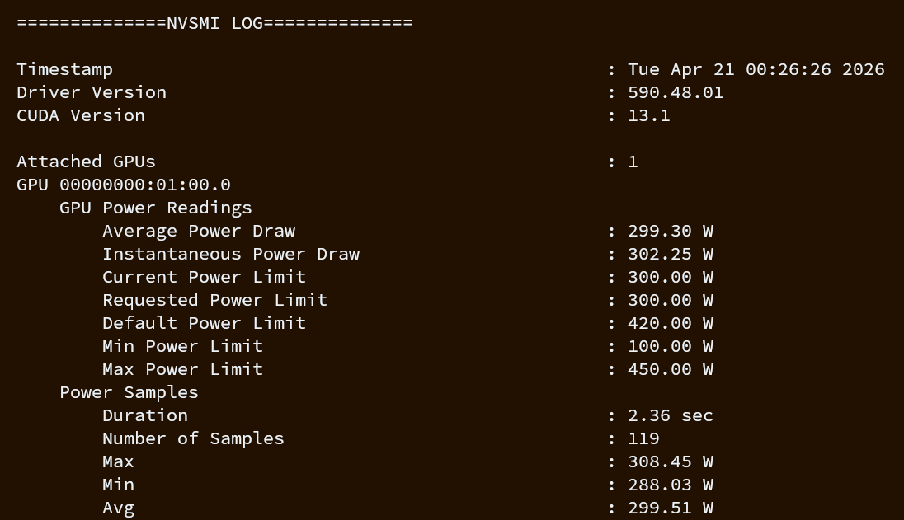

| [📰 𝕏](# "X.com Article link") | [🔥 **Abridged**](https://github.com/1iis/m01/blob/main/abridged.md "WIP") | [😼 **GitHub**](https://github.com/1iis/m01 "1iis/m01 repo with all files") | [📚 **SolveIT**](https://share.solve.it.com/d/ec8018951af13d01bc4dc8b03abb6663) | [Ⓜ️ **Markdown**](https://github.com/1iis/m01/blob/main/article.md "LLM-friendly input") | [🗒️ **Raw**](https://github.com/1iis/m01/raw/refs/heads/main/article.md "best with GET, wget, curl") |
| --- | --- | --- | --- | --- | --- |

# [ABRIDGED] Dockerizing<br> SGLang + vLLM<br> on local RTX 3090

> **Mission 1: Foundations**  
> *Let's discover the basics of running fast local inference jobs!*

> [!WARNING]
> This ABRIDGED version assumes prior knowledge about Linux administration and LLM inference.  
> If you are new to this, or want more information, please **check out the [full version](https://github.com/1iis/m01/blob/main/article.md) of this article!**

---

We implement a template to deploy two major AI GPU inference engines: [**SGLang**](https://www.sglang.io/) and [**vLLM**](https://vllm.ai/).

**Table of contents**

|    | Heading | Topics
|----|----------------|------------------
| 1. | **Host setup** | NVIDIA drivers<br>Docker install
| 2. | **Server \| 🅰️** | Configuration: ⚓ `docker-compose.yml`
| 3. | **Logs** | Observe:<br>server boot<br>readiness
| 4. | **Client \| 🅱️** | Tests:<br>Bash `curl`<br>🖼️ `test_stream.py`<br>📗 `long_ctx.py`
| 5. | **Logs, continued** | Observe:<br>HTTP Requests<br>Inference jobs
| 6. | **Hardware monitoring** | `nvidia-smi`<br>`btop`

---

## 1. Host setup

> [!NOTE] 
> **Skip** to **2. Server** if you already have the latest versions of **NVIDIA drivers** and **Docker**.

### NVIDIA drivers

Make sure your host machine has the latest Nvidia drivers for your GPU.

Use your distribution's preferred method to install.
- On Gnome, it's in the app **Software Sources** > **Additional Drivers**.
- On KDE you can open that from **Settings** > **Driver Manager**.
- On Ubuntu CLI, **`sudo ubuntu-drivers autoinstall`** should work.

After reboot, check that it's fine by running `nvidia-smi`.
```bash
nvidia-smi
Sat Apr 18 22:05:40 2026       
+----------------------------------------------------------------------+
| NVIDIA-SMI 590.48.01   Driver Version: 590.48.01  CUDA Version: 13.1 |
+------------------------------+------------------------+--------------+
```

### Docker

[Install Docker](https://docs.docker.com/engine/install/), following the steps for your Linux distribution.
```bash
docker --version   
Docker version 29.4.0, build 9d7ad9f
```

> [!CAUTION]
> Make sure to add your user to the `docker` group to avoid having to `sudo` all the time.
> ```bash
> sudo usermod -aG docker $USER
> ```

---

## 2. Server | 🅰️

### ⚓ `docker-compose.yml`

> *Use as a base template; add more services & profiles for each model.*

Our Docker Compose file can run either:
- **SGLang** (port `8001`), profile `sglang`
- or **vLLM** (port `8002`), profile `vllm`

📄 **`docker-compose.yml`**
```yaml
services:

  qwen35-4b-sglang:
    image: lmsysorg/sglang:latest
    container_name: qwen35-4b-sglang
    deploy:
      resources:
        reservations:
          devices:
            - driver: nvidia
              count: all
              capabilities: [gpu]
    ipc: host
    shm_size: 32g
    ports:
      - "8001:8000"
    volumes:
      - ~/.cache/huggingface:/root/.cache/huggingface
    command: >
      sglang serve
        --model-path Qwen/Qwen3.5-4B
        --port 8000
        --host 0.0.0.0
        --tp-size 1
        --mem-fraction-static 0.83
        --context-length 262144
        --kv-cache-dtype fp8_e4m3
        --reasoning-parser qwen3
    restart: no
    profiles: ["sglang"]
    environment:
      - HF_TOKEN=${HF_TOKEN}

  qwen35-4b-vllm:
    image: vllm/vllm-openai:latest
    container_name: qwen35-4b-vllm
    deploy:
      resources:
        reservations:
          devices:
            - driver: nvidia
              count: all
              capabilities: [gpu]
    ipc: host
    shm_size: 32g
    ports:
      - "8002:8000"
    volumes:
      - ~/.cache/huggingface:/root/.cache/huggingface
    command: >
      Qwen/Qwen3.5-4B
      --served-model-name Qwen/Qwen3.5-4B
      --port 8000
      --host 0.0.0.0
      --tensor-parallel-size 1
      --gpu-memory-utilization 0.78
      --max-model-len 262144
      --kv-cache-dtype fp8_e4m3
      --reasoning-parser qwen3
      --enable-prefix-caching
      --enable-chunked-prefill
      --max-num-seqs 64
    restart: no
    profiles: ["vllm"]
    environment:
      - HF_TOKEN=${HF_TOKEN}
```

The LLM demonstrated here is **Qwen3.5-4B** (full **16-bit** precision, most straightforward to run), with **FP8** KV cache to fit Qwen3.5's full context (`262,144` tokens) on a **single RTX 3090** or any 24 GB-class GPU.

### About this configuration

Three things you may want to adjust *now:* `HF_TOKEN` (get one or remove those lines), context size, and model choice.

- 🤗 **[`HF_TOKEN`](https://huggingface.co/settings/tokens)**
  > Optional: remove those two lines in the YAML if you won't have one.
  
  A [Hugging Face](https://huggingface.co/) (HF) Token to [accelerate downloads](https://huggingface.co/docs/huggingface_hub/en/package_reference/environment_variables#hfxethighperformance).  
Signup for a free HF account, and proceed to [**create new Access Token**](https://huggingface.co/settings/tokens/new?tokenType=read) (Read).

  Then add it to your environment (where you'll run `docker` commands).
  ```bash
  export HF_TOKEN=hf_...   # paste your token.
  # Consider adding this line to .bashrc for persistence.
  ```
  
  Alternatively, use a `.env` file (same dir as `docker-compose.yml`, or at a path set by `--env-file` therein).

- 🥵 If your GPU lacks VRAM for the above configuration, two low-hanging fruits.
  
  1. You may **reduce context size**, e.g. by half.  
     `--context-length 131072`  
     `--max-model-len 131072`
  
  2. You may **choose a [smaller](https://huggingface.co/Qwen/Qwen3.5-2B) [Qwen3.5](https://huggingface.co/collections/Qwen/qwen35) [variant](https://huggingface.co/Qwen/Qwen3.5-0.8B)**.  
     Copy the name of the maker/model (e.g. `Qwen/Qwen3.5-0.8B`) and replace it in your config (three times, two for vLLM).

- 👻 You may also rent a cloud GPU with ≥24 GB VRAM, but then you're on your own for the docker setup.

### Deploy

#### Create the configuration file

Clone the **repo `1iis/m01`** (Mission 1) with all files.

```bash
git clone https://github.com/1iis/m01.git
cd m01
```

You may `git init` for convenience.

#### Build the containers

Either way, from the same directory, launch the service/profile with:
```bash
# Pick one:
export COMPOSE_PROFILES=sglang
export COMPOSE_PROFILES=vllm

# Build it
docker compose up -d   # will build the above choice

# Kill it
docker compose down    # kill the container entirely
```

Change the value of the environment variable `COMPOSE_PROFILES` to select the other engine.

> [!IMPORTANT]
Make sure you always ` down ` the one running before switching profile to build `up` the other one.  
Otherwise, the GPU may get OOM (Out Of Memory) and the build will silently fail.

---

## 3. Logs

> [!NOTE]
> *You may skip to* **4. Client | 🅱️** *now that you have a `docker-compose.yml` file ready and the server started.*

Check server logs.
```bash
# Either by profile
docker compose --profile sglang logs -f
docker compose --profile vllm logs -f

# or container name
docker compose logs -f qwen35-4b-sglang
docker compose logs -f qwen35-4b-vllm
```

When the server is ready, a log entry tells you so.

- In SGLang: **`The server is fired up and ready to roll!`**
  ```
  INFO:     127.0.0.1:47826 - "POST /v1/chat/completions HTTP/1.1" 200 OK
  The server is fired up and ready to roll!
  ```

- In vLLM: **`INFO:     Application startup complete.`**
  ```
  INFO:     Started server process [1]
  INFO:     Waiting for application startup.
  INFO:     Application startup complete.
  ```

---

## 4. Client | 🅱️

### Bash

Run a basic `curl`. Change localhost port to `8002` for vLLM.

```bash
curl http://localhost:8001/v1/chat/completions \
  -H "Content-Type: application/json" \
  -d '{
    "model": "Qwen/Qwen3.5-4B",
    "messages": [{"role": "user", "content": "What is the meaning of life, the universe, and everything?"}],
    "temperature": 0.7,
    "max_tokens": 4096
  }' | jq .
```

👇 This returns a JSON object with `"content"` and `"reasoning_content"` fields that you may inspect.


> *OpenAI chat template, JSON payload.*

---

### Environment variables

For the Python scripts, we use the OpenAI library which automatically sources the following two environment variables.  
This lets us keep our script generic, no hardcoded port or URL.
```bash
export OPENAI_API_KEY="EMPTY"

# Pick one:
export OPENAI_BASE_URL="http://localhost:8001/v1"  # SGLang
export OPENAI_BASE_URL="http://localhost:8002/v1"  # vLLM
```

---

### 🖼️ Text + Vision input → Streaming output

[`test_stream.py`](https://github.com/1iis/m01/blob/main/test_stream.py) sends:
- an image of a real-world location (Comuna 13 in Bogotá, Colombia)
- a question in text: *"Where it this?"*

📄 **`test_stream.py`**
```python
from openai import OpenAI
# Configured by environment variables: OPENAI_API_KEY and OPENAI_BASE_URL
client = OpenAI()

messages = [
    {
        "role": "user",
        "content": [
            {
                "type": "image_url",
                "image_url": {
                    "url": "https://qianwen-res.oss-accelerate.aliyuncs.com/Qwen3.5/demo/RealWorld/RealWorld-04.png"
                }
            },
            {
                "type": "text",
                "text": "Where is this?"
            }
        ]
    }
]

stream = client.chat.completions.create(
    model="Qwen/Qwen3.5-4B",
    messages=messages,
    max_tokens=32768,
    temperature=0.7,
    top_p=0.8,
    presence_penalty=1.5,
    extra_body={
        "top_k": 20,
        "chat_template_kwargs": {"enable_thinking": False},
    },
    stream=True,
    stream_options={"include_usage": True}
)

def stream_and_print(response_stream):
    usage = None
    model_name = None
    for chunk in response_stream:
        if chunk.choices and chunk.choices[0].delta.content:
            print(chunk.choices[0].delta.content, end="", flush=True)
        if chunk.usage is not None:
            usage = chunk.usage
            model_name = chunk.model
    print()
    print("\n=== Metadata ===")
    print(f"Model: {model_name}")
    print(f"Tokens: {usage}")

stream_and_print(stream)
```

Run it.
```bash
python test_stream.py
```
👇

Example output:
```markdown
This is **Bogotá, Colombia** — specifically, the view from a rooftop or elevated location overlooking the city’s dense hillside neighborhoods.

The large statue in the foreground is part of the **“Origen”** project — a cultural and artistic initiative that includes sculptures, installations, and events celebrating indigenous heritage and identity. The word “Origen” (meaning “origin” or “source”) appears on the railing below the sculpture.

### Key features visible:
- **Dense urban sprawl across hillsides**, typical of Bogotá’s topography.
- **Residential buildings climbing up mountains**, showing how the city has grown vertically.
- **Modern high-rises mixed with older structures**, reflecting Bogotá’s evolving urban landscape.
- **Greenery and palm trees** near the sculpture, indicating some green spaces even within the city.
- The **“LIVE” badge** suggests this photo was taken during a live stream or social media post.

### Context:
The “Origen” project is located in the **Chapinero Alto** neighborhood, one of Bogotá’s most vibrant and culturally rich areas. It often hosts festivals, art exhibitions, and community gatherings.

So, while the exact spot isn’t named in the image, you’re looking at **Bogotá from above**, likely near the Chapinero Alto area where the Origen installation resides.

📍 *Location: Bogotá, Colombia – near Chapinero Alto / Origen Project*
```
```
=== Metadata ===
Model: Qwen/Qwen3.5-4B
Tokens: CompletionUsage(completion_tokens=304, prompt_tokens=2470, total_tokens=2774, completion_tokens_details=None, prompt_tokens_details=None)
```

---

### 📗 Book-long input → Long output

[`long_ctx.py`](https://github.com/1iis/m01/blob/main/long_ctx.py) sends a whole book to stress-test context length.

I've used the awesome [Project Gutenberg](https://www.gutenberg.org/) to retrieve plain text (UTF-8) books. They''re in the [`books/`](https://github.com/1iis/m01/tree/main/books) dir in the repo.

Select books whose token count is below your declared context window length in `docker-compose.yml`.  
For instance,
- [Frankenstein](books/frankenstein.txt) **~99k** tokens: good for a 131k context;
- [Dracula](books/dracula.txt) **~216k** tokens: good for a 262k context.

<!-- [[TODO]]: Make a nice table with Qwen3.5 exact token count; refine books in the repo (or make a dedicated repo for that and other samples); calc remaining tokens and % of 262,144 -->

This script:
- sends the book (shell argument);
- asks the LLM to write an essay and then a sequel chapter.

📄 **`long_ctx.py`**
```python
import sys
from openai import OpenAI

client = OpenAI()

if len(sys.argv) < 2:
    print("Usage: python long_ctx.py <path_to_txt_file>")
    print("Example: python long_ctx.py frankenstein.txt")
    sys.exit(1)

txt_path = sys.argv[1]

print(f"📖 Loading book from: {txt_path}")
with open(txt_path, 'r', encoding='utf-8') as f:
    book_text = f.read()

print(f"✅ Loaded {len(book_text):,} characters (~{len(book_text.split()):,} words) — ready for 100k+ token test\n")

messages = [
    {
        "role": "user",
        "content": f"""Here is the complete text of a novel:

{book_text}

Now, using the entire book above, write an extremely long and detailed response (use as many tokens as possible up to the limit):

1. Provide a comprehensive literary analysis essay (aim for maximum depth and length) covering all major themes, full character arcs, narrative structure (frame story), key symbols, and historical/biographical context.
2. After the essay, write an original sequel chapter that continues directly from the end of the novel. Make the sequel rich, emotionally intense, and at least 4,000 words long.

Be extremely thorough, quote specific passages from the book, and expand on every point. This is a long-context stress test: use everything you read."""
    }
]

stream = client.chat.completions.create(
    model="Qwen/Qwen3.5-4B",
    messages=messages,
    max_tokens=32768,
    temperature=0.7,
    top_p=0.8,
    presence_penalty=1.5,
    extra_body={
        "top_k": 20,
        "chat_template_kwargs": {"enable_thinking": False},
    },
    stream=True,
    stream_options={"include_usage": True}
)

def stream_and_print(response_stream):
    usage = None
    model_name = None
    for chunk in response_stream:
        if chunk.choices and chunk.choices[0].delta.content:
            print(chunk.choices[0].delta.content, end="", flush=True)
        if chunk.usage is not None:
            usage = chunk.usage
            model_name = chunk.model
    print()
    print("\n=== Metadata ===")
    print(f"Model: {model_name}")
    print(f"Tokens: {usage}")

stream_and_print(stream)
```

Run it, with the text file containing the book as argument. E.g.:
```bash
python long_ctx.py frankenstein.txt
python long_ctx.py dracula.txt
```

The LLM takes a few minutes to load the massive input (SGLang has great logs if you want to monitor that, see below **5. Logs, continued**).

---

## 5. Logs, continued

### Live inspection

The logs on the server will show activity during or after the task.

```
qwen35-4b-vllm  | (APIServer pid=1) INFO:     172.18.0.1:33818 - "POST /v1/chat/completions HTTP/1.1" 200 OK
qwen35-4b-vllm  | (APIServer pid=1) INFO 04-18 22:48:24 [loggers.py:259] Engine 000: Avg prompt throughput: 247.0 tokens/s, Avg generation throughput: 30.4 tokens/s, Running: 0 reqs, Waiting: 0 reqs, GPU KV cache usage: 0.0%, Prefix cache hit rate: 0.0%, MM cache hit rate: 0.0%
qwen35-4b-vllm  | (APIServer pid=1) INFO 04-18 22:48:34 [loggers.py:259] Engine 000: Avg prompt throughput: 0.0 tokens/s, Avg generation throughput: 0.0 tokens/s, Running: 0 reqs, Waiting: 0 reqs, GPU KV cache usage: 0.0%, Prefix cache hit rate: 0.0%, MM cache hit rate: 0.0%
qwen35-4b-vllm  | (APIServer pid=1) INFO:     172.18.0.1:40806 - "POST /v1/chat/completions HTTP/1.1" 200 OK
qwen35-4b-vllm  | (APIServer pid=1) INFO 04-18 22:50:24 [loggers.py:259] Engine 000: Avg prompt throughput: 35.8 tokens/s, Avg generation throughput: 29.8 tokens/s, Running: 0 reqs, Waiting: 0 reqs, GPU KV cache usage: 0.0%, Prefix cache hit rate: 42.8%, MM cache hit rate: 50.0%
```

SGLang is a bit more verbose by default.

```
qwen35-4b-sglang  | [2026-04-18 23:02:14] Prefill batch, #new-seq: 1, #new-token: 2048, #cached-token: 0, full token usage: 0.36, mamba usage: 0.03, #running-req: 0, #queue-req: 0, cuda graph: False, input throughput (token/s): 2589.96
qwen35-4b-sglang  | [2026-04-18 23:02:15] Prefill batch, #new-seq: 1, #new-token: 973, #cached-token: 0, full token usage: 0.36, mamba usage: 0.03, #running-req: 0, #queue-req: 0, cuda graph: False, input throughput (token/s): 4467.39
qwen35-4b-sglang  | [2026-04-18 23:02:15] INFO:     172.18.0.1:45748 - "POST /v1/chat/completions HTTP/1.1" 200 OK
qwen35-4b-sglang  | [2026-04-18 23:02:15] Decode batch, #running-req: 1, #full token: 95186, full token usage: 0.36, mamba num: 2, mamba usage: 0.03, cuda graph: True, gen throughput (token/s): 0.14, #queue-req: 0
qwen35-4b-sglang  | [2026-04-18 23:02:15] Decode batch, #running-req: 1, #full token: 95226, full token usage: 0.36, mamba num: 2, mamba usage: 0.03, cuda graph: True, gen throughput (token/s): 55.54, #queue-req: 0
```

---

### Worth checking out

- **HTTP requests**: initiating URL, METHOD, API endpoint requested, response code (same grammar for both engines)  
  `INFO:     172.18.0.1:45748 - "POST /v1/chat/completions HTTP/1.1" 200 OK`  

- **Engine ops**: lines beginning with  
  `qwen35-4b-sglang  | [2026-04-20 21:08:24]`  
  `qwen35-4b-vllm  | (APIServer pid=1) INFO 04-18 22:48:24 [loggers.py:259] Engine 000: `  
  - tokens/second **in**  
     SGLang: `input throughput (token/s): 2632.62`  
     vLLM: `Avg prompt throughput: 247.0 tokens/s`  
  - tokens/second **out**  
     SGLang: `gen throughput (token/s): 109.54`  
     vLLM: `Avg generation throughput: 30.4 tokens/s`  

  - **KV cache usage** (how much of your context is used on the GPU, in tokens)  
     SGLang: `#full token: 140003, full token usage: 0.71` (%)  
     vLLM: `GPU KV cache usage: 38.6%`

  - **Cache hits** (how much of your prompt was already in cache)  
    vLLM: `Prefix cache hit rate: 42.8%, MM cache hit rate: 50.0%`  

---

### Re-run the scripts

Both, and multiple requests, simultaneously! Check that everything works fine, and that cache works: generation starts instantly when you re-send the book prompt over and over again!

Look/`grep` for "`cache`":

- SGLang: `cached-tokens: ...`
- vLLM: [`prefix`|`MM`] `cache hit rate: ...%`

```
Prefill batch, #new-seq: 1, #new-token: 973, #cached-token: 94208, ...
```

---

## 6. Hardware monitoring

### `nvidia-smi`

The first thing is to watch `nvidia-smi` to monitor your GPU temperature, power draw, and VRAM usage.
```bash
nvidia-smi -l 1   # Refresh every 1 second
```


> ` Process ` ` Type ` `G`*: Graphics;* ` Type ` `C`*: CUDA.*  

---

### `btop`

A favorite of mine for quick system monitoring.
```bash
sudo apt install btop
btop
```

We get this pretty GPU box, whose dashboard is fairly complete and more compact than `nvidia-smi`.



> *btop is for top beauty*

To see the above GPU box, you may need to add **`gpu0`** to **shown boxes** (pic below).  
Press <kbd>Esc</kbd> for **Options**. 



> *btop Settings > Shown boxes: "gpu0" added after "cpu"*

---

### Managing temperature

If temperature is above 65-ish (GPU wil throttle), you have two major levers to tweak.

#### Fan speed

Check and enforce fan speed in the **Nvidia X Server Settings** app (should come with drivers).

1. Check the box **Enable GPU Fan Settings** (if unavailable: search "nvidia coolbits" for your Xorg/Wayland config)
2. Set desired % value
3. Click **Apply** button


> Try to keep temperate well below 80°C for best performance.

#### Power Draw

⚡ You may want to soft-limit power to a more reasonable value than your card's default, as this generally has negligible performance impact but makes it run cooler and lowers your electricity bill.

Right now, you can check **`Current Power Limit`** with:
```bash
 nvidia-smi -q -d POWER
```


> *Add* `-l 2` *to monitor Instantaneous Power Draw while running inference.*

If you want to try a different setting, you can issue a new **Requested Power Limit**.
```bash
sudo nvidia-smi -pm 1
sudo nvidia-smi -pl 300  # value in Watts
nvidia-smi -q -d POWER   # check effects
```

This should now read as your **Current Power Limit**.  
It won't survive reboot though, unless you make it a `systemd` `service`, or DE script.

> [!CAUTION]
> **NEVER** mess with power settings beyond the **Min/Max Power Limit** range.
> 
> For our purposes, about ¼ to ⅓ **below** the **Default Power Limit** (420 W on this EVGA 3090) is usually where we want to live, for most GPUs. In my case, running at 300 W instead yields -10°C, 30% cheaper bill, and about the same performance.

---

## Parting words

This concludes our first dive into local inference. If you've made it to the end, **thank you** for reading, and **congratulations!** 🙌

There is a ton more to cover. I hope you like the Docker approach and our local scripts being endpoint-agnostic, letting us orchestrate and scale entirely from the shell.

Future articles, as hinted throughout this first one, will cover many more use cases and features, adding tools to our inference kit as we go.

**Coming Soon™**

I will also soon begin tests on a 3060 12 GB to see what can effectively be run on the famed -60 class of GPUs.

Until we meet again,

***Happy prompting!***
