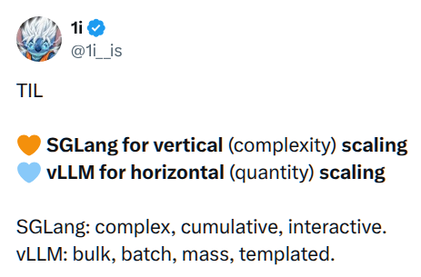
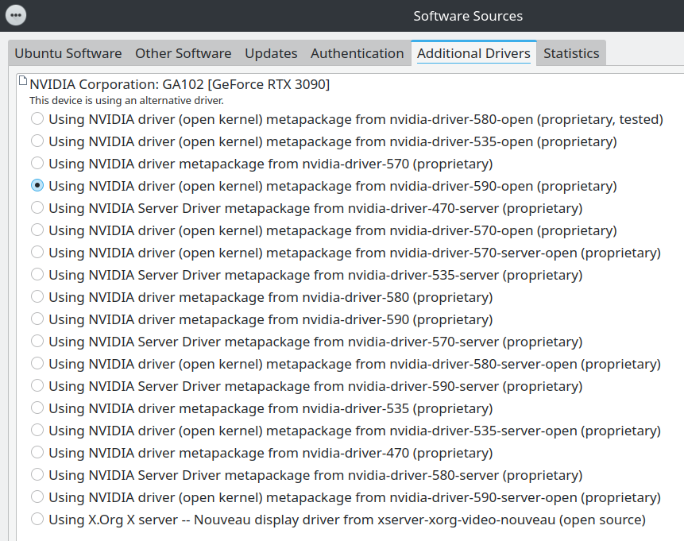
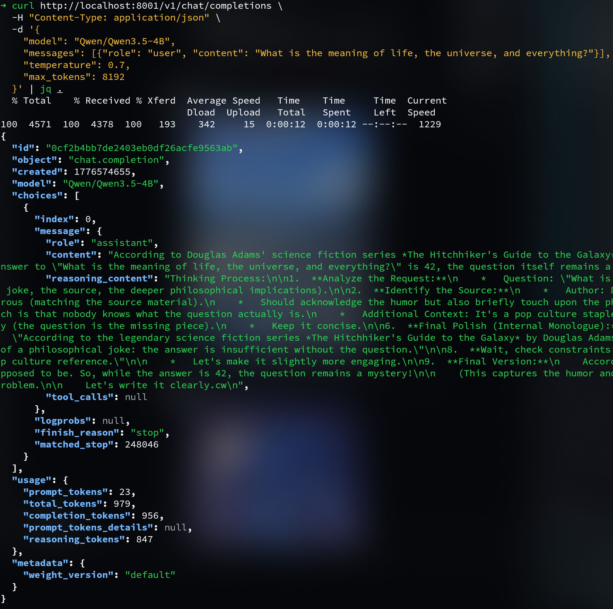
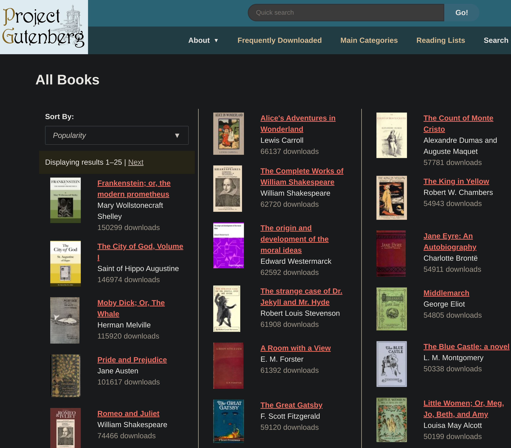

| [📰 𝕏](# "will be known upon publishing the final draft") | [🔥 **Abridged**](https://github.com/1iis/m01/blob/main/abridged.md "WIP") | [😼 **GitHub**](https://github.com/1iis/m01 "1iis/m01 repo with all files") | [📚 **SolveIT**](https://share.solve.it.com/d/ec8018951af13d01bc4dc8b03abb6663) | [Ⓜ️ **Markdown**](https://github.com/1iis/m01/blob/main/article.md "LLM-friendly input") | [🗒️ **Raw**](https://github.com/1iis/m01/raw/refs/heads/main/article.md "best with GET, wget, curl") |
| --- | --- | --- | --- | --- | --- |

# Dockerizing SGLang + vLLM on local RTX 3090

> **Mission 1: Foundations**  
> *Let's discover the basics of running fast local inference jobs!*

---

## Introduction

We implement a template to deploy two major AI inference engines: [**SGLang**](https://www.sglang.io/) and [**vLLM**](https://vllm.ai/).

> *They each have unique benefits and features.  
> I'm far from having an informed opinion, but AFAICT:*
>
> [](https://x.com/1i__is/status/2045325838640456019)

The goal here isn't to do anything special.  
Just to get our feet wet, run some GPU inference, see the parts and how they may be wired together. Good foundations for our brain and PC going forward!

Running AI models is a straightforward server-client architecture.  
For this mission, two files:

- 📥 **`docker-compose.yml`** (container serving the LLM)
- 📤 **Python script** (client sending prompts)

The Docker compose stack has two services/profiles:  
🧡 **SGLang**  
🩵 **vLLM**  

I've included two Python scripts.  
🅰️ **`test_stream.py`**: short test that shows how to add a picture to the input.  
🅱️ **`long_ctx.py`**: stress-test for context length (KV cache) that shows how to add an external file (here, a full book in plain text).  

---

**TABLE OF CONTENTS**
1. **Host setup** (drivers, Docker)
2. **Inference engine server** (Docker compose)
3. **Logs**
4. **Client** (test prompts with Python scripts)
5. **Logs, continued**
6. **Hardware monitoring** (`nvidia-smi`, `btop`)

> ⏩ *If you already have the latest NVIDIA drivers and Docker, skip to 2.*

---

## 1. Host setup
First, make sure your host machine has the latest Nvidia drivers for your GPU (on Kubuntu 24.04, I have 590 / CUDA 13.1 at the time of writing).

Use your distribution's preferred method to install.
- On Gnome, it's in the app **Software Sources** > **Additional Drivers**.
- On KDE you can open that from **Settings** > **Driver Manager**.
- On Ubuntu, **`sudo ubuntu-drivers autoinstall`** should work.

> Note: I was on 570 (hadn't upgraded in a while), and 590 failed to install.  
> I solved the issue by going first to 580, then 590 (reboot each time).



> *NVIDIA driver (open kernel) metapackage from nvidia-driver-590-open (proprietary)*

After reboot, check that it's fine by running `nvidia-smi`.

```bash
nvidia-smi
Sat Apr 18 22:05:40 2026       
+----------------------------------------------------------------------+
| NVIDIA-SMI 590.48.01   Driver Version: 590.48.01  CUDA Version: 13.1 |
+------------------------------+------------------------+--------------+
```

You do **not** need to install the CUDA-cudnn nvcc stack on the host! 😁

```bash
nvcc --version 
zsh: command not found: nvcc
```

> 💡 ***That's the whole point of using Docker:**  
We use CUDA from isolated containers, thus letting us play with **any specific CUDA version** ≤ host, which is agnostic to what our containers run. The images we use (SGLang, vLLM) pack everything we need. No need to destroy your native host to accommodate multiple incompatible packages/versions (same idea as venvs; same limitation as with Linux host kernel version in containers).*

Speaking of which, if you haven't already, [install Docker](https://docs.docker.com/engine/install/).
(Follow the steps for your Linux distribution.)

```bash
docker --version   
Docker version 29.4.0, build 9d7ad9f
```

> ⚠️ Make sure to add your user to the `docker` group to avoid having to `sudo` all the time (must log out or reboot to take effect).

---

## 2. Inference engine server
> *Use as a base template; add more services/profiles for each model.  
> We'll explore how to build upon this base in future articles.*

Here's the Docker Compose file to run either:
- **SGLang** (port `8001`), profile `sglang`
- or **vLLM** (port `8002`), profile `vllm`

The LLM demonstrated here is Qwen3.5-4B (full 16-bit precision), with FP8 KV cache to fit Qwen3.5's full context (262,144 tokens) on a single RTX 3090.

> 🥵 If your GPU has less VRAM, you may reduce context size by half, and choose a [smaller](https://huggingface.co/Qwen/Qwen3.5-2B) [Qwen3.5](https://huggingface.co/collections/Qwen/qwen35) [variant](https://huggingface.co/Qwen/Qwen3.5-0.8B). We'll cover quantizations in later articles.
> 
> 👻 You can also rent a cloud 24 GB GPU for a few dozen cents per hour, but you're on your own for the infra setup. It will be covered in a later article (lots of platforms, lots of recipe variations to cover).

I've mapped most parameters 1:1 between the two engines (same things, same order between `--port` and `--reasoning-parser`) so you can compare their respective names in SGLang and vLLM.
```yaml
services:

  qwen35-4b-sglang:
    image: lmsysorg/sglang:latest
    container_name: qwen35-4b-sglang
    deploy:
      resources:
        reservations:
          devices:
            - driver: nvidia
              count: all
              capabilities: [gpu]
    ipc: host
    shm_size: 32g
    ports:
      - "8001:8000"
    volumes:
      - ~/.cache/huggingface:/root/.cache/huggingface
    command: >
      sglang serve
        --model-path Qwen/Qwen3.5-4B
        --port 8000
        --host 0.0.0.0
        --tp-size 1
        --mem-fraction-static 0.83
        --context-length 262144
        --kv-cache-dtype fp8_e4m3
        --reasoning-parser qwen3
    restart: no
    profiles: ["sglang"]
    environment:
      - HF_TOKEN=${HF_TOKEN}

  qwen35-4b-vllm:
    image: vllm/vllm-openai:latest
    container_name: qwen35-4b-vllm
    deploy:
      resources:
        reservations:
          devices:
            - driver: nvidia
              count: all
              capabilities: [gpu]
    ipc: host
    shm_size: 32g
    ports:
      - "8002:8000"
    volumes:
      - ~/.cache/huggingface:/root/.cache/huggingface
    command: >
      Qwen/Qwen3.5-4B
      --served-model-name Qwen/Qwen3.5-4B
      --port 8000
      --host 0.0.0.0
      --tensor-parallel-size 1
      --gpu-memory-utilization 0.78
      --max-model-len 262144
      --kv-cache-dtype fp8_e4m3
      --reasoning-parser qwen3
      --enable-prefix-caching
      --enable-chunked-prefill
      --max-num-seqs 64
    restart: no
    profiles: ["vllm"]
    environment:
      - HF_TOKEN=${HF_TOKEN}
```

> 👾 *In a future article, we'll discuss these and more command flags, see how we can review startup logs to tighten our configuration, and discover neat features of these engines.*

🤗 [`HF_TOKEN`](https://huggingface.co/settings/tokens): You should have a [Hugging Face](https://huggingface.co/) account, and proceed to [**create a Read Access Token**](https://huggingface.co/settings/tokens/new?tokenType=read). It'll help [accelerate downloads](https://huggingface.co/docs/huggingface_hub/en/package_reference/environment_variables#hfxethighperformance).


> *Choose whichever token name makes sense to you.*

To reproduce this deployment, you may download/clone the repo with all files (a), or copy/paste files manually (b).

- (a) Repo (easier, faster):
  ```bash
  # Pick one:
  git clone https://github.com/1iis/26D19-1.foundations.git
  git clone git@github.com:1iis/26D19-1.foundations.git
  gh repo clone 1iis/26D19-1.foundations
  
  # Make it your current working dir
  cd 26D19-1.foundations
  ```

- (b) Or manually:
  ```bash
  # navigate to a directory of your choice
  cd <some_path>
  
  nano docker-compose.yml
  # Paste the above YAML configuration: Ctrl + Shift + v
  # Save: Ctrl + o → Enter
  # Exit: Ctrl + x
  ```

Either way, from the same directory, launch the service/profile with:
```bash
# Pick one:
export COMPOSE_PROFILES=sglang
export COMPOSE_PROFILES=vllm

# Build it
docker compose up -d   # will build the above choice

# Kill it
docker compose down    # kill the container entirely
```

Change the value of the environment variable `COMPOSE_PROFILES` to select the other engine. Alternatively, you can activate profiles directly (no env var needed) as shown below.
```bash
# Build / kill SGLang
docker compose --profile sglang up -d
docker compose --profile sglang down

# Build / kill vLLM
docker compose --profile vllm up -d
docker compose --profile vllm down
```

🥵 **Troubleshooting**  
If a build fails, it may be because you're tight on memory (logs should say so). In that case, you may decrease context, or model size.
```yaml
# SGLang service
command: >
  sglang serve
    --model-path Qwen/Qwen3.5-0.8B
    ...
    --context-length 131072

# vLLM service
command: >
  Qwen/Qwen3.5-0.8B
    ...
    --max-model-len 131072
```

> ⏩ *In a hurry? Now that you have this `docker-compose.yml` file ready and the server started, you may skip to **4. Client**. But if things fail, you'll need logs to inspect and debug.*

---

## 3. Logs
These commands let you see the logs from the server in real time. Extremely useful to know what's going on. Immediately after building or starting a container, check its logs with one of these commands.
```bash
# Either by profile
docker compose --profile sglang logs -f
docker compose --profile vllm logs -f

# or container name
docker compose logs -f qwen35-4b-sglang
docker compose logs -f qwen35-4b-vllm
```

When the server is ready, the logs tell you so.

In SGLang: **`The server is fired up and ready to roll!`**
```
INFO:     Started server process [1]
INFO:     Waiting for application startup.
INFO:     Application startup complete.
INFO:     Uvicorn running on http://0.0.0.0:8000 (Press CTRL+C to quit)
INFO:     127.0.0.1:47822 - "GET /model_info HTTP/1.1" 200 OK
Prefill batch, #new-seq: 1, #new-token: 80, #cached-token: 0, full token usage: 0.00, mamba usage: 0.03, #running-req: 0, #queue-req: 0, cuda graph: False, input throughput (token/s): 0.00
INFO:     127.0.0.1:47826 - "POST /v1/chat/completions HTTP/1.1" 200 OK
The server is fired up and ready to roll!
```

In vLLM: **`Application startup complete.`**
```INFO 04-18 22:30:24 [api_server.py:594] Starting vLLM server on http://0.0.0.0:8000
INFO 04-18 22:30:24 [launcher.py:37] Available routes are:
INFO 04-18 22:30:24 [launcher.py:46] Route: /openapi.json, Methods: HEAD, GET
INFO 04-18 22:30:24 [launcher.py:46] Route: /docs, Methods: HEAD, GET
INFO 04-18 22:30:24 [launcher.py:46] Route: /docs/oauth2-redirect, Methods: HEAD, GET
INFO 04-18 22:30:24 [launcher.py:46] Route: /redoc, Methods: HEAD, GET
INFO 04-18 22:30:24 [launcher.py:46] Route: /tokenize, Methods: POST
INFO 04-18 22:30:24 [launcher.py:46] Route: /detokenize, Methods: POST
INFO 04-18 22:30:24 [launcher.py:46] Route: /load, Methods: GET
INFO 04-18 22:30:24 [launcher.py:46] Route: /version, Methods: GET
INFO 04-18 22:30:24 [launcher.py:46] Route: /health, Methods: GET
INFO 04-18 22:30:24 [launcher.py:46] Route: /metrics, Methods: GET
INFO 04-18 22:30:24 [launcher.py:46] Route: /v1/models, Methods: GET
INFO 04-18 22:30:24 [launcher.py:46] Route: /ping, Methods: GET
INFO 04-18 22:30:24 [launcher.py:46] Route: /ping, Methods: POST
INFO 04-18 22:30:24 [launcher.py:46] Route: /invocations, Methods: POST
INFO 04-18 22:30:24 [launcher.py:46] Route: /v1/chat/completions, Methods: POST
INFO 04-18 22:30:24 [launcher.py:46] Route: /v1/chat/completions/batch, Methods: POST
INFO 04-18 22:30:24 [launcher.py:46] Route: /v1/responses, Methods: POST
INFO 04-18 22:30:24 [launcher.py:46] Route: /v1/responses/{response_id}, Methods: GET
INFO 04-18 22:30:24 [launcher.py:46] Route: /v1/responses/{response_id}/cancel, Methods: POST
INFO 04-18 22:30:24 [launcher.py:46] Route: /v1/completions, Methods: POST
INFO 04-18 22:30:24 [launcher.py:46] Route: /v1/messages, Methods: POST
INFO 04-18 22:30:24 [launcher.py:46] Route: /v1/messages/count_tokens, Methods: POST
INFO 04-18 22:30:24 [launcher.py:46] Route: /inference/v1/generate, Methods: POST
INFO 04-18 22:30:24 [launcher.py:46] Route: /scale_elastic_ep, Methods: POST
INFO 04-18 22:30:24 [launcher.py:46] Route: /is_scaling_elastic_ep, Methods: POST
INFO 04-18 22:30:24 [launcher.py:46] Route: /v1/chat/completions/render, Methods: POST
INFO 04-18 22:30:24 [launcher.py:46] Route: /v1/completions/render, Methods: POST
INFO:     Started server process [1]
INFO:     Waiting for application startup.
INFO:     Application startup complete.
```

You will then see logs printed upon inference requests (see **5. Logs, continued**).

> 🔬 *In a later article about parameters for SGLang and vLLM, we'll study some of the information provided by those logs before the above excerpts. They provide very useful information about memory use, tokens in KV cache (effective context we can use), overhead (Samba, CUDA graphs, etc.), and other details worth knowing about our configuration.*

---

## 4. Client

🆑 **CLI**  
The very first test you can run is a basic `curl`.  
Below is for SGLang, change localhost port to `8002` for vLLM.
```bash
curl http://localhost:8001/v1/chat/completions \
  -H "Content-Type: application/json" \
  -d '{
    "model": "Qwen/Qwen3.5-4B",
    "messages": [{"role": "user", "content": "What is the meaning of life, the universe, and everything?"}],
    "temperature": 0.7,
    "max_tokens": 4096
  }' | jq .
```

👇 This returns a JSON object (pretty with jq), with `"content"` and `"reasoning_content"` fields that you may inspect.



> *OpenAI chat template, JSON payload.*  
> "reasoning_content" is the "Thinking" part you see before the LLM actually replies (collapsed by default on most GUI like Grok). You may see its token count in "usage": {"reasoning_tokens": 847} out of a total response of "completion_tokens": 956 (which means the actual response is ~100 tokens, 8x less than the "reasoning" budget).

> ⚠️ On a cloud GPU, replace `http://localhost:8001` with your instance public IP and port. Likewise for `OPENAI_BASE_URL` below.

---

🅾️ **OpenAI environment variables**  
For the Python scripts, we use the OpenAI library which automatically sources the following two environment variables. This lets us keep our script generic, no hardcoded port or URL.
```bash
export OPENAI_API_KEY="EMPTY"

# Pick one:
export OPENAI_BASE_URL="http://localhost:8001/v1"  # SGLang
export OPENAI_BASE_URL="http://localhost:8002/v1"  # vLLM
```

These two ports are defined in the above YAML Docker Compose configuration (in **2. Inference engine server**); change them as you wish but match the Docker services.

> You may simplify and use the same port for both if you never run them concurrently, which will likely be the case on a single 24 GB GPU.

Now, two Python scripts for tests.

---

🅰️ **Text + Vision input → Streaming output**  
The first test sends an image and a question, to test multimodal input with vision, and stream output nicely printed in the terminal.


> Comuna 13 in Bogotá, Colombia — viewed from the Origen rooftop bar.

Create a Python file if you haven't cloned the repo:
```bash
nano test_stream.py
```

Paste the script below into it ( <kbd>Ctrl</kbd> + <kbd>Shift</kbd> + <kbd>v</kbd>).  
Then save and exit ( <kbd>Ctrl</kbd> + <kbd>o</kbd> ⇒ <kbd>Enter</kbd> ⇒ <kbd>Ctrl</kbd> + <kbd>x</kbd> ).

```python
from openai import OpenAI
# Configured by environment variables
client = OpenAI()

messages = [
    {
        "role": "user",
        "content": [
            {
                "type": "image_url",
                "image_url": {
                    "url": "https://qianwen-res.oss-accelerate.aliyuncs.com/Qwen3.5/demo/RealWorld/RealWorld-04.png"
                }
            },
            {
                "type": "text",
                "text": "Where is this?"
            }
        ]
    }
]

stream = client.chat.completions.create(
    model="Qwen/Qwen3.5-4B",
    messages=messages,
    max_tokens=32768,
    temperature=0.7,
    top_p=0.8,
    presence_penalty=1.5,
    extra_body={
        "top_k": 20,
        "chat_template_kwargs": {"enable_thinking": False},
    },
    stream=True,
    stream_options={"include_usage": True}
)

def stream_and_print(response_stream):
    usage = None
    model_name = None
    for chunk in response_stream:
        if chunk.choices and chunk.choices[0].delta.content:
            print(chunk.choices[0].delta.content, end="", flush=True)
        if chunk.usage is not None:
            usage = chunk.usage
            model_name = chunk.model
    print()
    print("\n=== Metadata ===")
    print(f"Model: {model_name}")
    print(f"Tokens: {usage}")

stream_and_print(stream)
```

Run it with:
```bash
# Ubuntu
python3 test_stream.py  # or however you named it

# Most others
python test_stream.py
```

👇

```markdown
This is **Bogotá, Colombia** — specifically, the view from a rooftop or elevated location overlooking the city’s dense hillside neighborhoods.

The large statue in the foreground is part of the **“Origen”** project — a cultural and artistic initiative that includes sculptures, installations, and events celebrating indigenous heritage and identity. The word “Origen” (meaning “origin” or “source”) appears on the railing below the sculpture.

### Key features visible:
- **Dense urban sprawl across hillsides**, typical of Bogotá’s topography.
- **Residential buildings climbing up mountains**, showing how the city has grown vertically.
- **Modern high-rises mixed with older structures**, reflecting Bogotá’s evolving urban landscape.
- **Greenery and palm trees** near the sculpture, indicating some green spaces even within the city.
- The **“LIVE” badge** suggests this photo was taken during a live stream or social media post.

### Context:
The “Origen” project is located in the **Chapinero Alto** neighborhood, one of Bogotá’s most vibrant and culturally rich areas. It often hosts festivals, art exhibitions, and community gatherings.

So, while the exact spot isn’t named in the image, you’re looking at **Bogotá from above**, likely near the Chapinero Alto area where the Origen installation resides.

📍 *Location: Bogotá, Colombia – near Chapinero Alto / Origen Project*

=== Metadata ===
Model: Qwen/Qwen3.5-4B
Tokens: CompletionUsage(completion_tokens=304, prompt_tokens=2470, total_tokens=2774, completion_tokens_details=None, prompt_tokens_details=None)
```

---

🅱️ **Book-long input → Long output**  
This second test sends a massive input (a whole book!) to stress-test context length.

First, let's retrieve some content to send. I use the awesome [Project Gutenberg](https://www.gutenberg.org/), it's a great source for free public domain books in plain text (UTF-8).


https://www.gutenberg.org/ebooks/search/?sort_order=downloads

- [Frankenstein](img/) **~99k** tokens
- [Dracula](img/) **~216k** tokens

<!-- [[TODO]]: Make a nice table with Qwen3.5 exact token count; refine books in the repo (or make a dedicated repo for that and other samples); calc remaining tokens and % of 262,144 -->

```bash
# Use wget
wget -O "frankenstein.txt" "https://www.gutenberg.org/cache/epub/84/pg84.txt"

# Or curl
curl -o "dracula.txt" "https://www.gutenberg.org/cache/epub/345/pg345.txt"
```

This is the Python script, which asks the LLM to write an essay and then a sequel chapter.
```bash
nano long_ctx.py
```

Paste the script below; then save and exit.

```python
import sys
from openai import OpenAI

client = OpenAI()

if len(sys.argv) < 2:
    print("Usage: python long_ctx.py <path_to_txt_file>")
    print("Example: python long_ctx.py frankenstein.txt")
    sys.exit(1)

txt_path = sys.argv[1]

print(f"📖 Loading book from: {txt_path}")
with open(txt_path, 'r', encoding='utf-8') as f:
    book_text = f.read()

print(f"✅ Loaded {len(book_text):,} characters (~{len(book_text.split()):,} words) — ready for 100k+ token test\n")

messages = [
    {
        "role": "user",
        "content": f"""Here is the complete text of a novel:

{book_text}

Now, using the entire book above, write an extremely long and detailed response (use as many tokens as possible up to the limit):

1. Provide a comprehensive literary analysis essay (aim for maximum depth and length) covering all major themes, full character arcs, narrative structure (frame story), key symbols, and historical/biographical context.
2. After the essay, write an original sequel chapter that continues directly from the end of the novel. Make the sequel rich, emotionally intense, and at least 4,000 words long.

Be extremely thorough, quote specific passages from the book, and expand on every point. This is a long-context stress test: use everything you read."""
    }
]

stream = client.chat.completions.create(
    model="Qwen/Qwen3.5-4B",
    messages=messages,
    max_tokens=32768,
    temperature=0.7,
    top_p=0.8,
    presence_penalty=1.5,
    extra_body={
        "top_k": 20,
        "chat_template_kwargs": {"enable_thinking": False},
    },
    stream=True,
    stream_options={"include_usage": True}
)

def stream_and_print(response_stream):
    usage = None
    model_name = None
    for chunk in response_stream:
        if chunk.choices and chunk.choices[0].delta.content:
            print(chunk.choices[0].delta.content, end="", flush=True)
        if chunk.usage is not None:
            usage = chunk.usage
            model_name = chunk.model
    print()
    print("\n=== Metadata ===")
    print(f"Model: {model_name}")
    print(f"Tokens: {usage}")

stream_and_print(stream)
```

Run it with the text file containing the book as argument.
```bash
python long_ctx.py frankenstein.txt
python long_ctx.py dracula.txt
```

The LLM will take a few minutes to load the massive input (SGLang has great logs if you want to monitor that, see below **5. Logs, continued**). The output will then be printed (hopefully nicely) in your terminal. Both scripts will report a usage summary at the end.

> 🛠️ *We'll explore deeper how to make inference clients fit various goals (latency, speed, cost, accuracy, …) in future articles. E.g. common patterns and libraries, chat templates, multimodal I/O, batching, interface with other software, multi-model orchestration, hybrid cloud/on-prem, load balancing, request routing, etc.*

---

## 5. Logs, continued
The logs on the server will show activity during or after the task.

```
qwen35-4b-vllm  | (APIServer pid=1) INFO:     172.18.0.1:33818 - "POST /v1/chat/completions HTTP/1.1" 200 OK
qwen35-4b-vllm  | (APIServer pid=1) INFO 04-18 22:48:24 [loggers.py:259] Engine 000: Avg prompt throughput: 247.0 tokens/s, Avg generation throughput: 30.4 tokens/s, Running: 0 reqs, Waiting: 0 reqs, GPU KV cache usage: 0.0%, Prefix cache hit rate: 0.0%, MM cache hit rate: 0.0%
qwen35-4b-vllm  | (APIServer pid=1) INFO 04-18 22:48:34 [loggers.py:259] Engine 000: Avg prompt throughput: 0.0 tokens/s, Avg generation throughput: 0.0 tokens/s, Running: 0 reqs, Waiting: 0 reqs, GPU KV cache usage: 0.0%, Prefix cache hit rate: 0.0%, MM cache hit rate: 0.0%
qwen35-4b-vllm  | (APIServer pid=1) INFO:     172.18.0.1:40806 - "POST /v1/chat/completions HTTP/1.1" 200 OK
qwen35-4b-vllm  | (APIServer pid=1) INFO 04-18 22:50:24 [loggers.py:259] Engine 000: Avg prompt throughput: 35.8 tokens/s, Avg generation throughput: 29.8 tokens/s, Running: 0 reqs, Waiting: 0 reqs, GPU KV cache usage: 0.0%, Prefix cache hit rate: 42.8%, MM cache hit rate: 50.0%
qwen35-4b-vllm  | (APIServer pid=1) INFO 04-18 22:50:34 [loggers.py:259] Engine 000: Avg prompt throughput: 0.0 tokens/s, Avg generation throughput: 0.0 tokens/s, Running: 0 reqs, Waiting: 0 reqs, GPU KV cache usage: 0.0%, Prefix cache hit rate: 42.8%, MM cache hit rate: 50.0%
```

SGLang is a bit more verbose. Here we finish loading a whole book (~100k tokens, 36% of our context), then start generating the output, then simultaneously send a second request (a short one, our first test) which then outputs at the same time (you can see `gen throughput (token/s)` jump above 100).

```
qwen35-4b-sglang  | [2026-04-18 23:02:13] Prefill batch, #new-seq: 1, #new-token: 2048, #cached-token: 0, full token usage: 0.34, mamba usage: 0.03, #running-req: 0, #queue-req: 0, cuda graph: False, input throughput (token/s): 2643.06
qwen35-4b-sglang  | [2026-04-18 23:02:13] Prefill batch, #new-seq: 1, #new-token: 2048, #cached-token: 0, full token usage: 0.35, mamba usage: 0.03, #running-req: 0, #queue-req: 0, cuda graph: False, input throughput (token/s): 2632.62
qwen35-4b-sglang  | [2026-04-18 23:02:14] Prefill batch, #new-seq: 1, #new-token: 2048, #cached-token: 0, full token usage: 0.36, mamba usage: 0.03, #running-req: 0, #queue-req: 0, cuda graph: False, input throughput (token/s): 2589.96
qwen35-4b-sglang  | [2026-04-18 23:02:15] Prefill batch, #new-seq: 1, #new-token: 973, #cached-token: 0, full token usage: 0.36, mamba usage: 0.03, #running-req: 0, #queue-req: 0, cuda graph: False, input throughput (token/s): 4467.39
qwen35-4b-sglang  | [2026-04-18 23:02:15] INFO:     172.18.0.1:45748 - "POST /v1/chat/completions HTTP/1.1" 200 OK
qwen35-4b-sglang  | [2026-04-18 23:02:15] Decode batch, #running-req: 1, #full token: 95186, full token usage: 0.36, mamba num: 2, mamba usage: 0.03, cuda graph: True, gen throughput (token/s): 0.14, #queue-req: 0
qwen35-4b-sglang  | [2026-04-18 23:02:15] Decode batch, #running-req: 1, #full token: 95226, full token usage: 0.36, mamba num: 2, mamba usage: 0.03, cuda graph: True, gen throughput (token/s): 55.54, #queue-req: 0
qwen35-4b-sglang  | [2026-04-18 23:02:16] Decode batch, #running-req: 1, #full token: 95266, full token usage: 0.36, mamba num: 2, mamba usage: 0.03, cuda graph: True, gen throughput (token/s): 55.74, #queue-req: 0
qwen35-4b-sglang  | [2026-04-18 23:02:17] Decode batch, #running-req: 1, #full token: 95306, full token usage: 0.36, mamba num: 2, mamba usage: 0.03, cuda graph: True, gen throughput (token/s): 55.49, #queue-req: 0
qwen35-4b-sglang  | [2026-04-18 23:02:18] Decode batch, #running-req: 1, #full token: 95346, full token usage: 0.36, mamba num: 2, mamba usage: 0.03, cuda graph: True, gen throughput (token/s): 55.57, #queue-req: 0
qwen35-4b-sglang  | [2026-04-18 23:02:18] Prefill batch, #new-seq: 1, #new-token: 421, #cached-token: 2048, full token usage: 0.37, mamba usage: 0.05, #running-req: 1, #queue-req: 0, cuda graph: False, input throughput (token/s): 267.67
qwen35-4b-sglang  | [2026-04-18 23:02:18] INFO:     172.18.0.1:43478 - "POST /v1/chat/completions HTTP/1.1" 200 OK
qwen35-4b-sglang  | [2026-04-18 23:02:18] Decode batch, #running-req: 2, #full token: 97857, full token usage: 0.37, mamba num: 4, mamba usage: 0.05, cuda graph: True, gen throughput (token/s): 59.36, #queue-req: 0
qwen35-4b-sglang  | [2026-04-18 23:02:19] Decode batch, #running-req: 2, #full token: 97937, full token usage: 0.37, mamba num: 4, mamba usage: 0.05, cuda graph: True, gen throughput (token/s): 109.06, #queue-req: 0
qwen35-4b-sglang  | [2026-04-18 23:02:20] Decode batch, #running-req: 2, #full token: 98017, full token usage: 0.37, mamba num: 4, mamba usage: 0.05, cuda graph: True, gen throughput (token/s): 108.89, #queue-req: 0
qwen35-4b-sglang  | [2026-04-18 23:02:20] Decode batch, #running-req: 2, #full token: 98097, full token usage: 0.37, mamba num: 4, mamba usage: 0.05, cuda graph: True, gen throughput (token/s): 109.43, #queue-req: 0
qwen35-4b-sglang  | [2026-04-18 23:02:21] Decode batch, #running-req: 2, #full token: 98177, full token usage: 0.37, mamba num: 4, mamba usage: 0.05, cuda graph: True, gen throughput (token/s): 109.54, #queue-req: 0
qwen35-4b-sglang  | [2026-04-18 23:02:22] Decode batch, #running-req: 2, #full token: 98257, full token usage: 0.37, mamba num: 4, mamba usage: 0.05, cuda graph: True, gen throughput (token/s): 108.73, #queue-req: 0
qwen35-4b-sglang  | [2026-04-18 23:02:23] Decode batch, #running-req: 1, #full token: 95626, full token usage: 0.36, mamba num: 2, mamba usage: 0.03, cuda graph: True, gen throughput (token/s): 88.26, #queue-req: 0
qwen35-4b-sglang  | [2026-04-18 23:02:23] Decode batch, #running-req: 1, #full token: 95666, full token usage: 0.36, mamba num: 2, mamba usage: 0.03, cuda graph: True, gen throughput (token/s): 52.35, #queue-req: 0
qwen35-4b-sglang  | [2026-04-18 23:02:24] Decode batch, #running-req: 1, #full token: 95706, full token usage: 0.36, mamba num: 2, mamba usage: 0.03, cuda graph: True, gen throughput (token/s): 54.90, #queue-req: 0
```

Inspecting that stuff is useful to get a feel for how different settings and user actions tend to impact the model and inference engine behavior.

> *You can see pretty obviously that more requests makes the GPU yield more tokens overall, even if each concurrent request individually gets slightly less than a single one.
AFAIK, maximum throughout for the GPU tends to be reached in the 6-12 range. But I have no idea first-hand. I'll be testing this and much more scenarios in the future.*

---

🆎 **Re-run the scripts** (both, and multiple instances, simultaneously!) to check that everything works fine, and that cache works: generation starts instantly when you re-send the book prompt over and over again!

Look/`grep` for `"cache"`:

- [`prefix`|`MM`] `cache hit rate: ...%` in vLLM
- `cached-tokens: ...` in SGLang

```
Prefill batch, #new-seq: 1, #new-token: 973, #cached-token: 94208, ...
```

---

## 6. Hardware monitoring
There's a lot to say here. You can use Prometheus, etc.  
The first thing is to watch `nvidia-smi` or `btop` to monitor your GPU/VRAM usage, power draw, temperature.

```bash
nvidia-smi -l 1   # Refresh every 1 second
```


> *Type G: Graphics; Type C: CUDA.  
> This GPU drives my display. Notice how Xorg + friends eat up nearly 6 GiB. This is why you want a dedicated GPU for AI if you can help it.*

If temperature is above 65-ish (GPU wil throttle), check and enforce fan speed in the **Nvidia X Server Settings** app (should come with drivers).


> ⚡ *You may want to cap power for a negligible performance impact, or even undervolt the chip to let it run cooler (that's the fabled "silicon lottery", if you're lucky it may remain stable at way lower voltage than factory; but Nvidia does great binning so you won't get Pro-grade thermals either).*
>
> We'll discuss Power Limit in a dedicated article about hardware; but you can check `Current Power Limit` among other stats with `nvidia-smi -q -d POWER`.
> 
> 
> 
> If you want to try a different Power Limit, you can do 
> ```bash
> sudo nvidia-smi -pm 1
> sudo nvidia-smi -pl 270 # value in Watts
> ```
> It won't survive reboot unless you make it a systemd service, though.

---

Finally, **`btop`** is a favorite of mine for quick system monitoring.

```bash
sudo apt install btop
# you may need to add "gpu0" to "Shown boxes" in the Menu (pic below)
```


> *btop Settings > Shown boxes: "gpu0" added after "cpu"*

We get this pretty GPU box, whose dashboard is fairly complete and more compact than `nvidia-smi`.


> *btop is for top beauty*

---

## Parting words


This concludes our first dive into local inference. If you've made it to the end, **thank you** for reading, and **congratulations!** 🙌 You can now use your local LLM, and why not explore HuggingFace to find more models to try to run! Just by using SGLang and vLLM, you will also notice differences between these two engines (both big and subtle), as well as invariance (hints that it may be dependent on the model, not the engine). This is how we build experience, flair.

There is a ton more to cover, and this was already fairly involved if you've never done it before. For those who've been there, done that, I hope you like the Docker approach to remove an entire category of problems related to virtual environments, drivers, CUDA versions, and other host-dependent issues. Containerizing early saves a ton of headaches for the entire OS lifetime. And our local scripts are endpoint-agnostic, letting us orchestrate and scale entirely from the shell.

Future articles, as hinted throughout this first one, will cover many more use cases and features, adding tools to our inference kit as we go.

**Coming Soon™**

I will also soon begin tests on a 3060 12 GB to see what can effectively be run on the famed -60 class of GPUs. Small open source models are getting incredibly good these days, and may cover way more needs that we realize! The fact is we don't need to pay for Opus / GPT / Grok quality for token-heavy yet simple-enough ops like search, summarize, refactor, describe, sort, substitute, etc. Rather, we want to default to doing these basic things with the smallest, cheapest, most local model that will do the job well; then feed clean, compact, narrowed results to the big expensive ones to fully leverage their capabilities when we need them.

I believe the question is not if but how much we can decrease the average model size used (read: cut the AI bill, whether in tokens, subs, or power) with the right workflows, clever engineering, and a great UX. idk. We'll make the rules as we go.

Until we meet again,
***Happy prompting!***